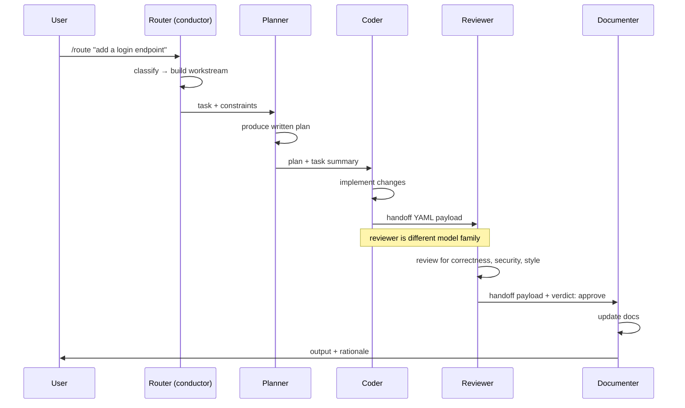

# Agents and Subagents

> Date: 2026-04-28

---

## What is an agent?

An agent is a language model operating in a loop: it receives a goal, decides which tool to call or what to write, observes the result, and continues until the goal is met or a stopping condition is hit.

The three components that make something an agent rather than a chat response:

| Component | What it means |
|---|---|
| **LLM** | A language model capable of following instructions and reasoning about tool use |
| **Tool use** | The ability to call external functions — read a file, run a command, call an API — and incorporate the result |
| **Goal pursuit over multiple turns** | The loop runs until done, not just until a single response is generated |

Without tool use, you have a chat completion. Without the loop, you have a single-turn generation. Both components together, with a goal, are what make the behavior "agentic."

---

## What is a subagent?

In Claude Code's terminology, a subagent is a child agent that runs in its own separate context window, spawned by a parent agent (or orchestrator) to handle a specific part of a task.

Key properties:

- **Isolated context window.** A subagent starts fresh. It does not inherit the parent's conversation history, loaded files, or in-memory state.
- **Explicit payload.** The parent must pass everything the subagent needs — task description, relevant file contents, constraints — as part of the invocation. Nothing is assumed.
- **Independent tool access.** The subagent can call tools (read files, run commands) within the permissions defined by its own agent definition file.
- **Skill preloading.** Skills (`.claude/skills/`) do not auto-load from the parent. They must be listed in the subagent's frontmatter.

In Project 42, subagents are defined as `.md` files in `.claude/agents/`. The current set:

```
router          classifies tasks into workstreams
planner         breaks non-trivial tasks into a written plan
coder           implements the plan
reviewer        reviews output — must be different model family from coder
documenter      writes or updates docs from code changes
test-writer     writes and extends tests
security-reviewer  reviews operate-workstream changes for security issues
investigator    researches and root-causes problems
operator        executes infrastructure and operational changes
```

---

## The conductor pattern

The conductor (or orchestrator) pattern is the standard multi-agent shape in Project 42. One agent acts as a conductor: it receives the top-level goal, decomposes it, dispatches subtasks to specialist subagents in sequence, and assembles the results.

The conductor does not do the work itself. It coordinates.



The conductor pattern produces auditable handoffs: each agent receives a structured YAML payload, not a blob of conversation. The reviewer sees only the handoff contract and the original task, not the coder's scratchpad.

---

## The parallel-discovery pattern

Some investigation and research tasks benefit from running multiple subagents simultaneously across different slices of the codebase. Each subagent works independently on its slice, and the orchestrator merges the findings.

This is useful when:

- A codebase is too large for one agent's context window.
- The task is naturally partitioned (e.g., "find all usages of the deprecated `auth.verify()` across four services").
- Speed matters and the subtasks are independent.

Example — investigating a cross-service latency issue:

```
Orchestrator
├── subagent A: trace /api/submit in service-auth
├── subagent B: trace /api/submit in service-gateway
└── subagent C: review recent changes in shared middleware
                        ↓
              Orchestrator merges findings
                        ↓
                  findings document
```

Each subagent gets a scoped goal and only the files relevant to its slice. Context isolation is the feature, not the limitation — it prevents one agent's analysis from contaminating another's.

---

## Why context isolation matters

When a subagent inherits a parent's full context, two problems arise:

1. **Token cost.** Every token in the parent's history costs tokens in the child's window. A parent at 80K tokens spawning five children costs 400K tokens of context overhead before any child does any work.

2. **Noise interference.** The parent's reasoning, partially-formed plans, and tool call results are not necessarily useful to the child. They can actively distort the child's behavior — the child may anchor on intermediate conclusions that the parent abandoned.

The structured handoff contract exists to pass only what the subagent needs: the task, the file list, the constraints, and the rationale. Nothing more.

This is also why **subagents do not inherit parent skills**. A skill loaded in the parent's session is not available in the child's context window unless explicitly listed in the child's frontmatter. This is enforced by Claude Code's runtime — not by convention.

---

## Agent files in this repo

Each agent is defined in `.claude/agents/<name>.md`. The file structure:

```markdown
---
name: <name>
model: <model-id>          # overrides Claude Code default if set
tools: [Read, Edit, Bash, ...]
skills: [skill-name, ...]  # preloaded skills
---

<system prompt for this agent>
```

The router reads `WORKSTREAMS.md` and `MODELS.md` at runtime to make routing and model-selection decisions. It does not hard-code workstream logic in its own prompt — the source of truth stays in the root files.

