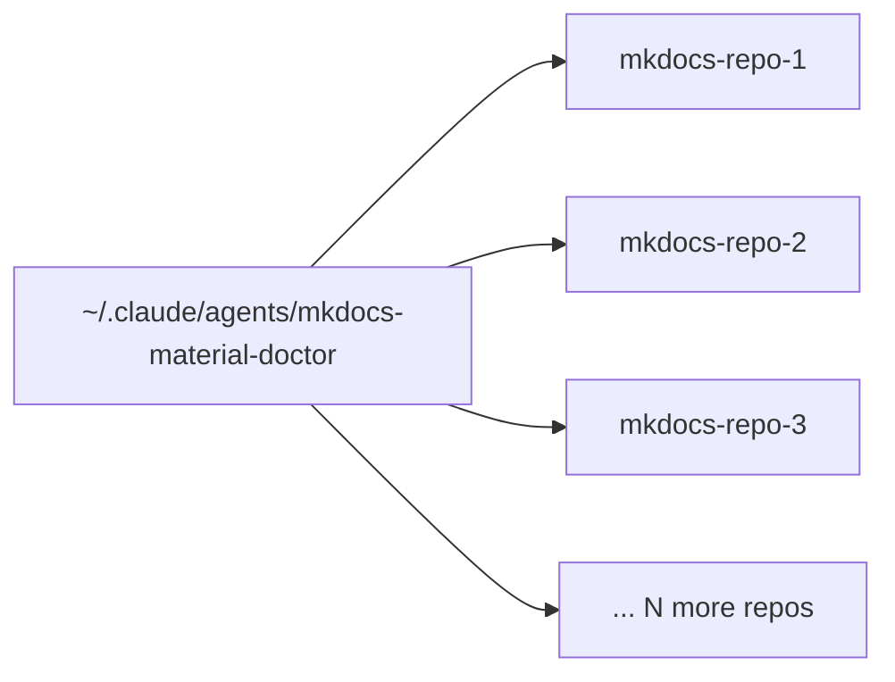

# Subagent Roster Design

**Last updated:** 2026-04-30

When a codebase grows across multiple repositories, one agent configuration per repo quickly duplicates effort and drifts out of sync. This document explains how to decide when a single agent should serve many repos, when each repo needs its own, and how to phase a rollout across a fleet.

The failure mode for getting this wrong: a "domain expert" agent that knows a lot about one stack gets copied to every repo — and then the copies diverge. Six months later, four of them still reference an old API. A shared user-level agent avoids that drift entirely.

---

## The decision space

Two questions drive every placement decision:

1. **Is this agent's knowledge specific to one repo, or transferable across all repos that share a stack?**
2. **Does the agent need repo-local context (CLAUDE.md stanzas, relative file paths, project conventions) to do its job?**

A *stack-family agent* knows how MkDocs Material plugins work, how PowerShell Pester tests are structured, or how Bicep deployment patterns are used — across all repos in that family. It does not need per-repo context. Put it at the user level.

A *repo agent* knows specific cmdlet names, API contracts, data schemas, or org conventions that only apply to one project. Put it at the repo level.

---

## User-level vs. repo-level agents

| Scope | Path | Loaded in | Best for |
|---|---|---|---|
| User-level | `~/.claude/agents/<name>.md` | Every session on this machine | Stack-family experts, fast-lookup helpers |
| Repo-level | `<repo>/.claude/agents/<name>.md` | Only that repo's sessions | Repo-specific knowledge |

**User-level agents** are available in every Claude Code session regardless of working directory. Avoid encoding repo-specific knowledge (file paths, project names, schema versions) in user-level agents — it becomes stale across projects.

**Repo-level agents** are isolated to their repo. They can safely reference exact file paths, test commands, deployment targets, and project conventions.

---

## The shared user-level agent pattern

When many repos share the same stack family, one user-level agent that understands the stack is cheaper and more consistent than N per-repo copies.

Example: 14 repos all use MkDocs Material with similar plugin configurations, `mike` for versioning, and the same nav conventions. Rather than writing 14 nearly-identical agents that would drift independently, one `mkdocs-material-doctor` agent at the user level covers all 14. Tradeoff: it can't carry per-repo knowledge (specific nav paths, custom macros), so it generalizes.

When repos in the same family start diverging significantly (different plugin stacks, incompatible nav schemas, radically different build pipelines), split them: either add repo-level agents that supplement the shared agent, or graduate them to individual repo-level agents.

---

## Phasing a rollout

A safe rollout order when applying this pattern to an existing fleet:

| Phase | Action |
|---|---|
| A | Enable `CLAUDE_CODE_EXPERIMENTAL_AGENT_TEAMS=1` if required — see [`docs/operations/settings-layering.md`](../operations/settings-layering.md) |
| B | Archive legacy agents to `_archive_[date]/` — do not delete; they are the fallback |
| C | Write user-level core agents (fast-lookup, prose editor, domain expert) |
| D | Write user-level shared agents by stack family |
| E | Write repo-specific agents for repos that need per-repo knowledge |
| F | Backfill `CLAUDE.md` stanzas in each affected repo so agents self-document |

Phase order matters: user-level core first (immediate value, low risk), shared stack agents next, then repo-specific agents last (highest risk of getting wrong without hands-on access to each repo).

---

## Pricing-aware tiering

Not all agents are equal in cost. See [`decisions/per-role-model-assignment.md`](../../decisions/per-role-model-assignment.md) for the full per-role rationale. The summary:

| Tier | Model | When |
|---|---|---|
| Cheap | Haiku | Fast read-only: "what does this file say", log triage |
| Default | Sonnet | Most agents — research, writing, code, planning |
| Heavy | Opus | Only the deep cross-repo researcher, or tasks with highest blast radius |

**Key point as of 2026-04-30:** Opus 4.6 and 4.7 are identically priced. The real cost lever is Sonnet by default, Opus only when the reasoning depth genuinely matters. Most agents — docs writers, scaffold helpers, module engineers — run at Sonnet.

---

## Cross-references

- [`docs/concepts/agents.md`](agents.md) — agent fundamentals
- [`decisions/per-role-model-assignment.md`](../../decisions/per-role-model-assignment.md) — per-role model rationale
- [`docs/operations/settings-layering.md`](../operations/settings-layering.md) — three-tier settings configuration
- [`examples/multi-repo-agent-roster.md`](../../examples/multi-repo-agent-roster.md) — sanitized real-world case study
