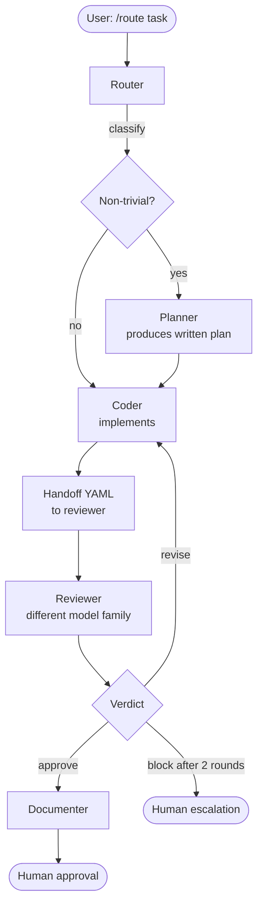

# Workstreams

> Date: 2026-04-28

---

## Why tasks need routing

Not all tasks have the same quality requirements, security surface, or agent pipeline. Running everything through a single "write code" agent produces inconsistent output — no review gate, no documentation step, no security check for operational changes.

The seven workstreams enforce that every task gets the pipeline appropriate to its risk and type:

- A **build** task needs a coder, an independent reviewer from a different model family, and a documenter.
- An **investigate** task needs an investigator that produces structured findings, not code.
- An **operate** task needs security review and mandatory human approval — it cannot self-complete.

Routing is the first step in every task. The `router` agent reads `WORKSTREAMS.md` and `MODELS.md`, classifies the task, and invokes the matching workstream skill.

---

## What a handoff contract is

A handoff contract is a structured YAML payload that one agent passes to the next agent in a pipeline. It is the only thing the receiving agent gets from the sending agent — not the conversation history, not the scratchpad, not intermediate reasoning.

This is deliberate:

- The reviewer sees only what the coder produced and chose to declare, not the coder's internal deliberation. This prevents anchoring bias.
- The payload is small, inspectable, and auditable. A human can read it.
- If a workstream fails, the payload is the artifact that shows where it broke.

The build workstream handoff from coder to reviewer:

```yaml
handoff:
  workstream: build
  task_summary: "[one sentence describing what was built]"
  files_modified: []
  files_created: []
  commands_run: []
  tests_added: true|false
  open_questions: []
  rationale: "[why this approach was chosen]"
```

The reviewer receives this payload and the original task description. Nothing else.

---

## How to read WORKSTREAMS.md

`WORKSTREAMS.md` at the repo root defines each workstream with:

1. **Trigger phrases** — natural language phrases the router uses to classify the task.
2. **Pipeline** — the ordered sequence of agents, shown as `A → B → C`.
3. **Handoff contract** — the YAML schema for structured payloads between agents.
4. **Hard rules** — constraints that cannot be overridden (e.g., "human approval is non-skippable").

The router agent reads this file at runtime. When you update `WORKSTREAMS.md`, the routing behavior changes without updating any agent prompts.

---

## The seven workstreams

| # | Name | Trigger examples | Ends with human? |
|---|---|---|---|
| 1 | build | "implement X", "add feature", "create Y", "build Z" | Yes, approval |
| 2 | review | "review this", "PR review", "check my code" | Yes, approval |
| 3 | refactor | "refactor", "clean up", "extract", "rename" | Yes, approval |
| 4 | test | "add tests", "test coverage", "write a test for" | Yes, approval |
| 5 | document | "document", "write README", "runbook" | Yes, approval |
| 6 | investigate | "why is", "what's causing", "root cause" | Yes, review |
| 7 | operate | "deploy", "rotate keys", "change permissions" | Yes, REQUIRED |

### 1. build

Creates new code or features. Pipeline: `router → (planner if non-trivial) → coder → reviewer → documenter → human`.

A task is non-trivial if it touches more than three files or is estimated at over one hour. If non-trivial, the planner runs first and produces a written plan that the coder must follow.

The cross-family review rule applies: the reviewer model family must differ from the coder's.

If the task touches `auth/`, `secrets/`, or `permissions/`, it automatically upgrades to the **operate** workstream regardless of the trigger phrase.

### 2. review

Standalone code review — not a post-build review, but a review triggered directly. Pipeline: `router → reviewer → human`.

Output is a structured review with: (1) correctness issues with line references, (2) security and PII issues, (3) style issues, (4) missing tests, (5) a go/no-go verdict.

The cross-family rule applies when the author's model family is known.

### 3. refactor

Behavior-preserving changes: restructuring, extraction, renaming, cleanup. Pipeline: `router → coder → reviewer → (documenter if API change) → human`.

Hard rule: behavior must not change. If the reviewer detects a behavioral change, it returns `verdict: block` and the workstream restarts as **build**.

### 4. test

Adding or expanding test coverage. Pipeline: `router → test-writer → reviewer → human`.

Output: new or extended test files plus a coverage delta report.

### 5. document

Writing or updating documentation: READMEs, runbooks, inline docs, API references. Pipeline: `router → documenter → self-review → human`.

Hard rule: no code changes in this workstream. If documentation requires new code examples that need to compile, spawn a separate build workstream first.

### 6. investigate

Root-cause analysis, triage, research questions. Pipeline: `router → investigator → human`.

Output is a structured findings document:

```yaml
findings:
  question: "[original question]"
  conclusion: "[one sentence]"
  evidence: []
  hypotheses_ruled_out: []
  unknowns: []
  recommended_next_step: "[one action]"
```

Hard rule: no speculation. "I don't know, here's what would unblock me" is a valid and preferred output.

### 7. operate

Infrastructure, secrets, permissions, production changes. Pipeline: `router → operator → security-reviewer → documenter → human (REQUIRED)`.

Human approval is non-skippable at the end. The security-reviewer must run on a different model family than the operator. All changes are logged to `.claude/logs/operate.jsonl`.

---

## A typical build workstream flow



The reviewer can send the work back to the coder for up to two revision rounds before the system escalates to a human. This cap prevents infinite loops between agents that have conflicting heuristics.

---

## When to escalate vs. when the workstream self-completes

| Condition | What happens |
|---|---|
| Reviewer returns `verdict: approve` | Workstream continues to documenter, then human approval |
| Reviewer returns `verdict: revise` | Coder receives revision notes and tries again (max 2 rounds) |
| Reviewer returns `verdict: revise` a second time | Escalate to human — do not retry a third time |
| Reviewer returns `verdict: block` on a refactor | Restart as build workstream |
| Task touches auth/secrets/permissions | Upgrade to operate workstream automatically |
| operate workstream completes | Always escalates to human — non-skippable |
| Agent hits 70–80% of token budget | Stops, summarizes, hands off to human |
| investigate produces findings | Outputs findings document; human decides next action |

The system is designed to self-complete for low-risk tasks (build, refactor, test, document, investigate) and to require human involvement for high-risk tasks (operate) and ambiguous situations (multiple revision rounds).
