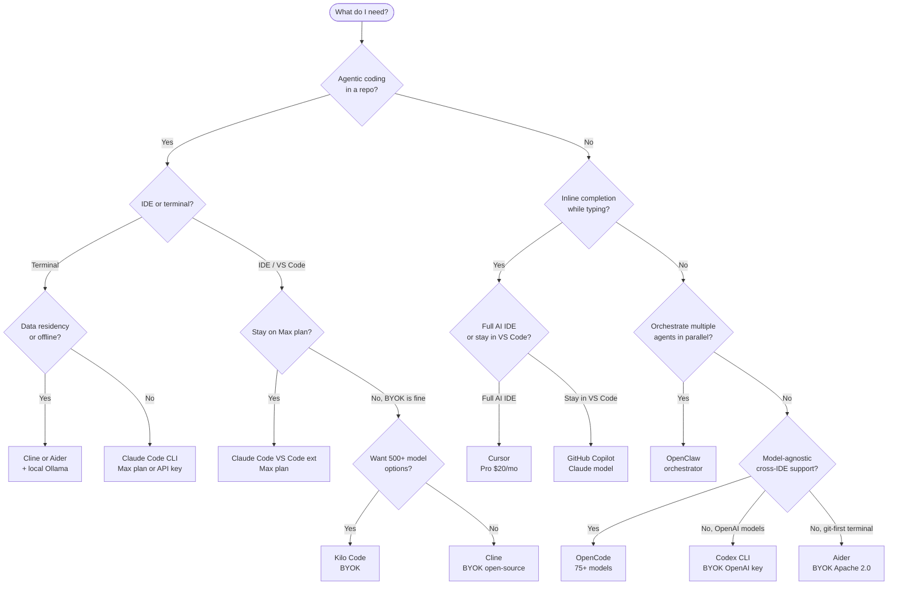

# Tool Selection Decision Table

**Last verified:** 2026-04-28

When to reach for each coding agent. This is the docs-layer explanation; the authoritative quick-reference table is in `decisions/tool-selection.md` at the repo root. This file adds the decision tree and edge case notes.

---

## 1. Quick decision table

| Criteria | Choice | Why |
|---|---|---|
| Multi-file agentic work, subagents, MCP, hooks | Claude Code CLI | Native ecosystem; Max plan; no per-token billing |
| Same as above + want inline diff preview in VS Code | Claude Code VS Code ext | Same Max plan; better diff UX inside the editor |
| Inline autocomplete while typing | GitHub Copilot (Claude model) | Always-on completion; separate GitHub billing; not agentic |
| Full AI IDE, best-in-class tab completion | Cursor | AI baked into a VS Code fork; flat Pro subscription |
| Open-source agent, VS Code, bring your own API key | Cline or Kilo Code | MIT/open; BYOK; no subscription; bills per-token via API |
| Open-source agent, terminal, git-aware auto-commits | Aider | Apache 2.0; git-first; lightweight; BYOK |
| Terminal agent, OpenAI models specifically | Codex CLI | OpenAI-native; BYOK OpenAI key |
| Terminal + desktop + broad IDE support, model-agnostic | OpenCode | 75+ models; JetBrains, Zed, Neovim, Emacs support |
| 500+ model options in VS Code | Kilo Code | Built on OpenCode server; widest model selection in VS Code |
| Orchestrate multiple agents across parallel worktrees | OpenClaw | Orchestrator, not a coder; dispatches to Claude Code/Aider/etc. |
| Data residency requirement (no external API calls) | Cline/Aider/OpenCode + local Ollama | Route BYOK tools to localhost Ollama endpoint |
| GUI-first developer, occasional AI use | Cursor or Claude Code VS Code ext | GUI diff previews; no terminal required |
| Terminal-first developer, heavy automation | Claude Code CLI or Aider | Terminal-native; scriptable; no IDE dependency |
| BYOM (pick your own model per task) | Cline, OpenCode, Aider, or Kilo Code | All accept arbitrary API endpoints |
| Flat-rate subscription (no per-token surprise bills) | Claude Code (Max plan) or Cursor Pro | Fixed monthly cost regardless of usage |

---

## 2. Decision tree

The following flowchart covers the most common branching decisions. Start at the top.

_This flowchart maps the primary decision axes — IDE vs. terminal, Max plan vs. BYOK, data residency, and single vs. multi-agent — to a concrete tool recommendation._

---

## 3. Edge cases and notes

### BYOK cost trap
Tools that bill per-token via your API key (Cline, Aider, Codex CLI, OpenCode, Kilo Code) can easily exceed the cost of a Claude Max plan during a heavy session. A 4-hour deep session on Claude Sonnet costs approximately $15–30 at API rates. At 20 working days per month, that is $300–600/month — well above the $100–200 Max plan. BYOK makes sense for light or irregular use, not for daily heavy coding sessions.

### OpenClaw is not a coding agent
OpenClaw orchestrates other agents. It does not write code itself. If you reach for OpenClaw, you also need to choose a coding agent (Claude Code, Aider, etc.) for it to dispatch. The two decisions are separate.

### Cursor vs. Claude Code VS Code ext
Both work inside VS Code-compatible editors. The key difference: Cursor is a full IDE fork — you switch applications. The Claude Code VS Code extension works inside your existing VS Code installation. If you have significant VS Code extension dependencies or established workflows, the Claude Code extension is less disruptive. If you are IDE-agnostic or starting fresh, Cursor's tab completion is better.

### Copilot is not on the Max plan
GitHub Copilot (even with Claude as the underlying model) is billed separately through GitHub. It does not consume your Anthropic Max plan. Using Copilot alongside Claude Code means paying two separate subscriptions. That is often still the right call (Copilot for always-on completion, Claude Code for agentic work), but model them as separate budget lines.

### Data residency with BYOK tools
Cline, Aider, and OpenCode accept any OpenAI-compatible API endpoint. Point them at a local Ollama instance (`http://localhost:11434/v1`) and no data leaves your machine. This is the correct pattern for air-gapped environments or PII-handling workflows that cannot use external APIs.

### Large multi-file tasks vs. single-file edits
For tasks that touch one file, the choice of tool matters less — even a chat interface works. For tasks spanning 10+ files with dependencies between changes, Claude Code's agentic loop (with tool calls for reading, writing, running tests, and checking git status) is significantly more reliable than a tool that issues one edit and stops. Scale the tool to the task.

---

## Related

- `decisions/tool-selection.md` — root-level authoritative table with cost comparison
- `docs/decisions/model-routing.md` — once you have the tool, which model to use
- `TOOL_LANDSCAPE.md` — full layer map of every tool in the ecosystem
- `reference/tools/` — individual one-pagers per tool
