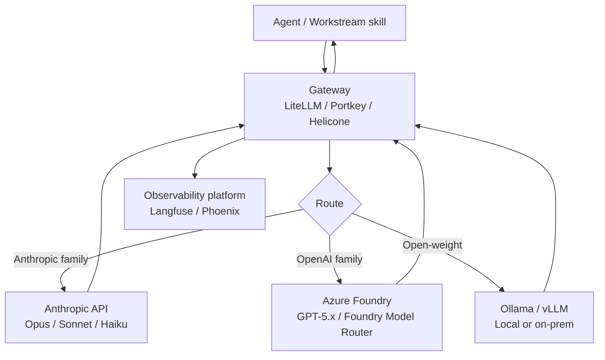

# Gateways

> Date: 2026-04-28

---

## What a gateway is and why you need one

A gateway sits between your application (or agent) and the LLM provider APIs. Every model call goes through it. This gives you a single point of control for:

- **Unified API surface.** One interface for Claude, GPT-5.x, Gemini, and open-weight models. Your code does not change when you add or swap providers.
- **Cost tracking.** Per-request token counts, costs, and model usage aggregated in one place.
- **Caching.** Identical prompts return cached responses instantly at zero inference cost.
- **Failover.** If a provider endpoint is down, the gateway routes to a fallback automatically.
- **Load balancing.** Distribute load across multiple API keys or deployment regions to stay under rate limits.
- **Model routing.** Route different request types to different models based on cost, latency, or capability criteria.

Without a gateway, each of these requires custom code per provider, and you have no unified view of spend.

---

## Comparison

| Tool | Type | License | Strengths | When to pick it |
|---|---|---|---|---|
| **LiteLLM** | OSS gateway + model router | MIT | 100+ model providers via one interface; Python-native; used as the routing layer inside CrewAI and other frameworks | When you need provider flexibility and are comfortable self-hosting; Python-heavy stack; want to run it as a local proxy or embed in code |
| **Portkey** | Gateway + observability + prompt management | MIT core; cloud plan available | Strong routing, failover, load balancing; prompt versioning built in; good for teams | When you want gateway + some observability in one tool; team use; managed option available |
| **Helicone** | Proxy-based observability + caching | Apache-2.0 core; cloud plan | Two-line setup (change base URL + add header); negligible added latency; free tier ~10K requests/month; good caching | When you want the fastest setup with minimal code change; primarily cost tracking and caching; Anthropic + OpenAI workloads |
| **OpenRouter** | Model router as a service | Proprietary | Access to many providers under one pay-per-token account; no infra to run | When you want a single payment account across providers without self-hosting anything; prototyping cross-family workflows |
| **Foundry Model Router** | Built-in model router (Azure Foundry) | Azure subscription required | Auto-picks among GPT-5 family models per request; advertised ~60% cost savings vs always-frontier; no extra infra | When your stack is already on Azure Foundry and you only need routing within the GPT-5 family |

---

## The two-layer pattern

A gateway and an observability platform serve different purposes. They are complementary, not redundant. Using both is the standard production setup.

| Layer | Purpose | Examples |
|---|---|---|
| **Gateway** | Routing, caching, failover, cost tracking, unified API | LiteLLM, Portkey, Helicone, OpenRouter, Foundry Model Router |
| **Observability** | Quality, evals, prompt versioning, session tracing, latency analysis | Langfuse, LangSmith, Arize Phoenix, OpenLLMetry |

A gateway tells you how much each call cost and whether it hit cache. An observability platform tells you whether the output was good, how latency is distributed across workstream steps, and whether a prompt change improved or degraded quality.

You need both to run this in production with confidence.

See [operations/observability.md](observability.md) for the observability layer.

---

## Where the gateway sits in the call stack



Every model call from an agent passes through the gateway. The gateway logs the call to the observability platform, checks cache, applies routing rules, and forwards to the appropriate provider. The response returns through the gateway before reaching the agent.

---

## Practical notes

### LiteLLM

Run as a local proxy:

```bash
litellm --model anthropic/claude-sonnet-4-6 --model azure/gpt-5.4 --port 4000
```

Your agent's base URL becomes `http://localhost:4000`. Model IDs use the `provider/model-name` format. LiteLLM translates to each provider's native API format.

Add to `.env`:

```
LITELLM_PROXY_URL=http://localhost:4000
ANTHROPIC_API_KEY=...
AZURE_API_KEY=...
AZURE_API_BASE=https://your-foundry-endpoint.openai.azure.com
```

### Helicone

The fastest setup. Change the base URL in your Anthropic SDK call and add your Helicone API key as a header. No server to run:

```python
import anthropic

client = anthropic.Anthropic(
    base_url="https://anthropic.helicone.ai",
    default_headers={"Helicone-Auth": f"Bearer {HELICONE_API_KEY}"}
)
```

Helicone logs the request, tracks cost, and serves from cache if available. The free tier handles roughly 10K requests per month.

### Foundry Model Router

No configuration required if you are already on Azure Foundry. Reference the router as a deployment in your Foundry resource and it selects the appropriate GPT-5 family model per request. Access via the standard OpenAI-compatible SDK with your Azure endpoint.

---

## Choosing for Project 42

The recommended setup for this repo:

| Scenario | Gateway choice |
|---|---|
| Local dev, cross-family workstreams (Claude + GPT-5.4) | LiteLLM proxy locally or Portkey cloud |
| Team with shared API spend tracking | Portkey or Helicone cloud |
| Fastest setup for prototyping | Helicone (two-line change) |
| GPT-5 family only, Azure subscription | Foundry Model Router |
| Cross-provider with no self-hosting | OpenRouter |

For a new setup: start with Helicone for instant visibility, add LiteLLM when you need multi-provider routing or want to self-host.

