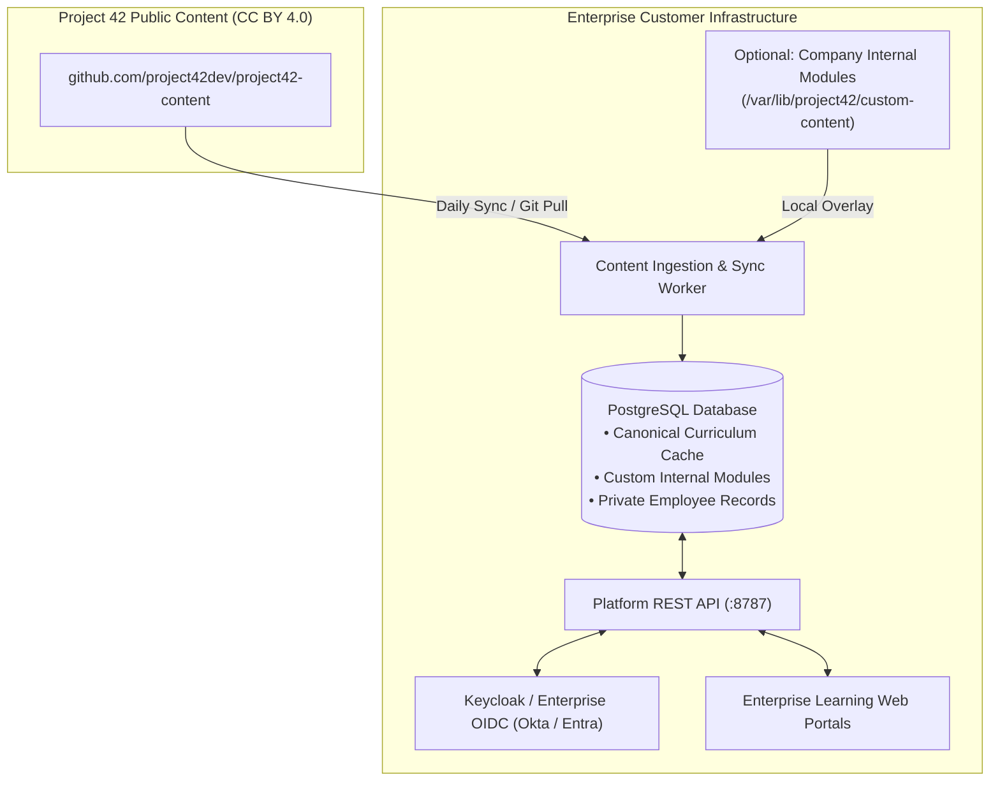

# Enterprise Content & Sync Administration Runbook (AB#8042)

## 1. Overview

Project 42 separates the software engine ([project42-platform](https://github.com/project42dev/project42-platform)) from the canonical open-source curriculum content ([project42-content](https://github.com/project42dev/project42-content)).

This allows enterprise administrators to:
1. Self-host the Project 42 platform in their private infrastructure (on-premise or VPC).
2. Receive continuous, automated curriculum and diagram updates from Project 42 without redeploying containers.
3. Overlay proprietary corporate AI training modules alongside the public curriculum.
4. Keep 100% of employee learning records, quiz scores, and transcripts private and air-gapped.

---

## 2. Architecture & Data Flow



---

## 3. Quickstart: Enabling Automated Content Sync in Docker Compose

In `self-host/compose.yaml`, the platform API is configured with dynamic content directories:

```yaml
services:
  api:
    image: project42/platform-api:latest
    environment:
      PROJECT42_CONTENT_DIR: /var/lib/project42/content
      PROJECT42_CUSTOM_CONTENT_DIR: /var/lib/project42/custom-content
    volumes:
      - ./content:/var/lib/project42/content:ro
      - ./custom-content:/var/lib/project42/custom-content:ro
```

### Initial Content Sync:
Clone the canonical content repository into your local deployment directory:

```bash
git clone https://github.com/project42dev/project42-content.git ./content
```

---

## 4. Ingesting Custom Enterprise Corporate Modules

Organizations can create custom internal courses (e.g. *“Internal AI Security & Corporate LLM Gateway”*):

1. Create a `custom-content` folder in your deployment root:
   ```bash
   mkdir -p ./custom-content/modules/internal-security
   ```
2. Add your corporate module definition (`./custom-content/modules/internal-security/gateway.json`):
   ```json
   {
     "id": "corp-llm-gateway",
     "title": "Corporate LLM Gateway Guidelines",
     "summary": "How to route internal model queries through the enterprise proxy.",
     "level": "beginner",
     "providers": ["provider-neutral"],
     "estimatedMinutes": 15,
     "objectives": [
       "Configure internal API tokens",
       "Understand data classification rules for prompts"
     ],
     "prerequisites": [],
     "sections": [
       {
         "id": "gateway-overview",
         "title": "Connecting to the Internal Proxy",
         "paragraphs": [
           "All requests to external frontier models must pass through the company gateway."
         ]
       }
     ]
   }
   ```
3. Add `catalog.json` in `./custom-content/catalog.json`:
   ```json
   {
     "schemaVersion": 1,
     "contentVersion": "1.0.0",
     "paths": [
       {
         "id": "corp-ai-guidelines",
         "title": "Company AI Guidelines",
         "summary": "Mandatory AI onboarding for engineering and product teams.",
         "audience": "Employees",
         "level": "beginner",
         "moduleIds": ["corp-llm-gateway"]
       }
     ]
   }
   ```
4. Run the sync command:
   ```bash
   docker compose exec api npm run content:sync
   ```
   The custom path and module will appear in your internal Learn portal alongside standard Project 42 modules.

---

## 5. Automated Upstream Updates (Cron Job)

To keep your local curriculum fresh with emerging AI topics, schedule a nightly cron job:

```bash
0 2 * * * cd /opt/project42/content && git pull --rebase && docker compose -f /opt/project42/compose.yaml exec api npm run content:sync
```

---

## 6. Offline / Air-Gapped Environments

For secure air-gapped environments without outbound internet access:
1. Download the latest `project42-content` release tarball from GitHub.
2. Transfer the archive to your offline environment via your standard security transfer protocols.
3. Extract into `./content` and execute `npm run content:sync`.
